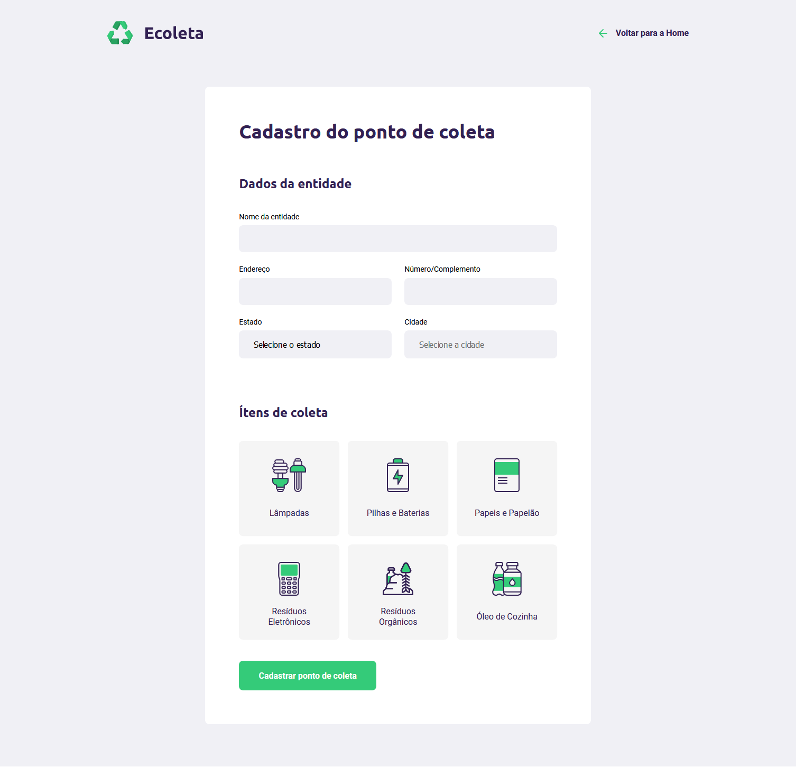
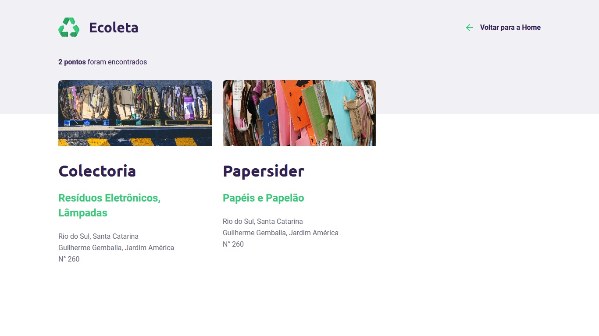

# Ecoleta
### Ecoleta permite a integração de pessoas que estão dispostas a descartar corretamente seus materiais, com os lugares adequados para o descarte. Cooperando por um mundo mais sustentável.

 
### Através do Ecoleta você pode cadastrar lugares para descarte sustentável.

### E encontrar os lugares cadastrados de acordo com a sua cidade.

